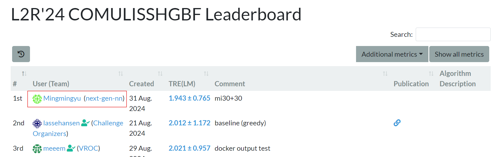

# Learn2Reg 2024 SHG-BF Multimodality Registration Challenge

 <!-- Replace with your actual logo path -->

## 🚀 Introduction

Welcome to the official code repository for the **Learn2Reg 2024 SHG-BF Multimodality Registration Challenge**. Our team, **Next-Gen-NN**, is proud to share our approach, which achieved **1st place in the validation phase** 🎉! In this project, we tackle the challenging task of multimodality image registration between Second Harmonic Generation (SHG) and Bright Field (BF) images using state-of-the-art deep learning techniques.

 <!-- Replace with the actual path to your screenshot -->

## 📄 Preprint Article

You can read more about our methodology and results in our preprint article available on [arXiv](https://arxiv.org/xxxxx).

## 🛠️ Setup

To get started with our code, you'll need to create a Conda environment using the provided `requirements.txt` file. Follow these steps:

```bash
# Clone the repository
git clone https://github.com/yourusername/yourrepository.git
cd yourrepository

# Create a new conda environment
conda create --name shgbf-env --file requirements.txt

# Activate the environment
conda activate shgbf-env
```

## 📂 Dataset

Please ensure that your test set is included in the `imagesTr` directory as outlined in the `COMULISSHGBF_dataset.json` file. This structure is crucial for the correct execution of the test scripts.

## 🏃‍♂️ Running the Evaluation

Our testing procedure involves splitting the test set into two halves. Use the following commands to run the evaluation:

### For the First Half of the Test Set:

```bash
python test_ShgBfReg_testset_io.py \
    -m tiramisuAndXfeatComplex \
    -bs 1 \
    --gpu_id 0 \
    --load_ckpt none \
    --is_first_half 1 \
    -dp PATH \
    ti_pretrained=0 \
    xf_pretrained=0
```

### For the Second Half of the Test Set:

```bash
python test_ShgBfReg_testset_io.py \
    -m tiramisuAndXfeatComplex \
    -bs 1 \
    --gpu_id 0 \
    --load_ckpt none \
    --is_first_half 0 \
    -dp PATH \
    ti_pretrained=0 \
    xf_pretrained=0
```

Replace `PATH` with the actual path to your dataset directory. The `--is_first_half` flag controls which half of the dataset is being processed.

## 📋 TL;DR

We test the model adapting the xfeat, tiramisu, and mutual information application from GlobalAlign. We also incorporate some ideas from ConvexAdam; for more detail, refer to the paper. Our setup uses `python==3.10` and `torch==2.0.0`. For test-time adaptation, we apply cross-correlation and mutual information techniques, running each for 30 iterations. To avoid issues with the randomness of initialization and the pitfalls of mutual information local minima, we run the mutual information process three times and select the best result.

## 🤝 Contributing

We welcome contributions! If you have ideas, suggestions, or improvements, please open an issue or submit a pull request. Let's make this project even better together!

## 📧 Contact

For any inquiries or support, please leave comments on issues in this GitHub Repo.

---

Made with ❤️ by the **Next-Gen-NN** team
